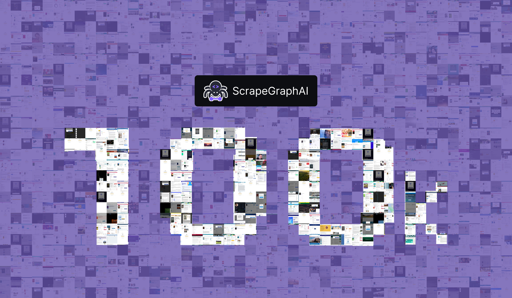

<p align="center">
  
</p>

<h1 align="center">🕷️ ScrapeGraphAI-100k Dataset</h1>

<p align="center">
  <a href="https://huggingface.co/datasets/scrapegraphai/scrapegraphai-100k"></a>
  <a href="https://arxiv.org/abs/2505.04016"></a>
  <a href="https://github.com/ScrapeGraphAI/Scrapegraph-ai"></a>
  
</p>

<p align="center">
  <b>100,000 real-world structured extraction examples from LLMs scraping the web</b>
</p>

---

# Overview

## Quick Start

```python
from datasets import load_dataset

dataset = load_dataset("scrapegraphai/scrapegraphai-100k")
train_data = dataset['train']

print(f"Dataset size: {len(train_data)}")
print(train_data[0])
```

## Evaluation Metrics

The `metric.py` module provides evaluation functions for JSON extraction tasks.

### JSON Validation

Check if a JSON string is valid and complies with a schema:

```python
from metric import json_validator

schema = {
    "type": "object",
    "properties": {"name": {"type": "string"}},
    "required": ["name"]
}

result = json_validator('{"name": "John"}', schema)
# {'is_valid': True, 'is_compliant': True}
```

### Metrics

Evaluate extraction quality with `magic_metric`:

```python
from metric import magic_metric, parse_json_remove_duplicates

pred = '{"name": "John", "age": 30, "tags": ["a", "b"]}'
true = {"name": "john", "age": 30, "tags": ["b", "a"], "city": "NYC"}

pred = parse_json_remove_duplicates(pred)
if pred is None:
    pred = {}
result = magic_metric(pred, true)
```

Returns:
| Metric | Description |
|--------|-------------|
| `key_precision` | Fraction of predicted keys that exist in ground truth |
| `key_recall` | Fraction of ground truth keys found in prediction |
| `key_f1` | Harmonic mean of precision and recall |
| `missing_keys` | Count of keys in ground truth but not in prediction |
| `extra_keys` | Count of keys in prediction but not in ground truth |
| `value_score` | Average field score (BLEU for strings, exact match for numbers/bools, set comparison for arrays) |
| `overall_bleu` | BLEU score on serialized JSON strings |

## Installation

Requires Python 3.12+ and [uv](https://docs.astral.sh/uv/).

```bash
uv sync --extra dev
```

For local serving with vllm (installed separately due to conflicting numba/numpy pins):

```bash
uv pip install vllm
```

## Links

- 🤗 [Hugging Face Dataset](https://huggingface.co/datasets/scrapegraphai/scrapegraphai-100k)
- 🤗 [Hugging Face Dataset for Finetuning](https://huggingface.co/datasets/scrapegraphai/scrapegraph-100k-finetuning)
- 📄 [arXiv Paper](TODO)
- 🕷️ [ScrapeGraphAI Library](https://github.com/ScrapeGraphAI/Scrapegraph-ai)

## Training (Modal)

```bash
modal run modelling/train.py --dry-run
modal run --detach modelling/train.py
```

## Evaluation (Modal)

```bash
modal run modelling/evaluation.py
modal run --detach modelling/evaluation.py
modal run --detach modelling/evaluation.py --lora /checkpoints/default/final
```


## Merge LoRA

Merge the LoRA adapter into the base model for faster inference (no runtime LoRA overhead, enables CUDA graphs):

```bash
python -m modelling.merge_lora \
  --model-name Qwen/Qwen3-1.7B \
  --lora-path sg-checkpoints/efficient-frost-76/final
```

Saves to `sg-checkpoints/efficient-frost-76/merged` by default. Use `--output-path` to override.

## Quantize (W4A16)

Quantize the merged model to 4-bit weights for faster inference and lower VRAM usage. Uses GPTQ with calibration data from the training set:

```bash
python -m modelling.quantize \
  --model-path sg-checkpoints/efficient-frost-76/merged
```

Saves to `sg-checkpoints/efficient-frost-76/merged-w4a16`. Use `--output-path` to override.

## Serve

Quantized model (recommended, fastest):

```bash
vllm serve sg-checkpoints/efficient-frost-76/merged-w4a16 \
  --max-model-len 8192 \
  --gpu-memory-utilization 0.95 \
  --enable-prefix-caching \
  --port 8000
```

Merged model (fp16):

```bash
vllm serve sg-checkpoints/efficient-frost-76/merged \
  --max-model-len 8192 \
  --gpu-memory-utilization 0.9 \
  --enable-prefix-caching \
  --port 8000
```

On a 3090 (24GB), use the quantized model with Marlin kernels:

```bash
vllm serve sg-checkpoints/efficient-frost-76/merged-w4a16 \
  --max-model-len 8192 \
  --gpu-memory-utilization 0.8 \
  --enable-prefix-caching \
  --port 8000
```

Or fp16 with `--enforce-eager` to skip CUDA graph capture:

```bash
vllm serve sg-checkpoints/efficient-frost-76/merged \
  --max-model-len 8192 \
  --gpu-memory-utilization 0.9 \
  --enforce-eager \
  --port 8000
```


```bash
vllm serve sg-checkpoints/efficient-frost-76/merged-w4a16 \
  --max-model-len 8192 \
  --gpu-memory-utilization 0.9 \
  --enforce-eager \
  --port 8000
```
With LoRA (without merging, slowest):

```bash
vllm serve Qwen/Qwen3-1.7B \
  --max-model-len 8192 \
  --gpu-memory-utilization 0.9 \
  --enable-lora \
  --lora-modules adapter=sg-checkpoints/efficient-frost-76/final \
  --enforce-eager \
  --port 8000
```

Then:

```bash
curl http://localhost:8000/v1/chat/completions \
  -H "Content-Type: application/json" \
  -d '{
    "model": "sg-checkpoints/efficient-frost-76/merged-w4a16",
    "messages": [{"role": "user", "content": "your prompt here"}],
    "temperature": 0.0,
    "max_tokens": 4096,
    "repetition_penalty": 1.1,
    "chat_template_kwargs": {"enable_thinking": false}
  }'
```